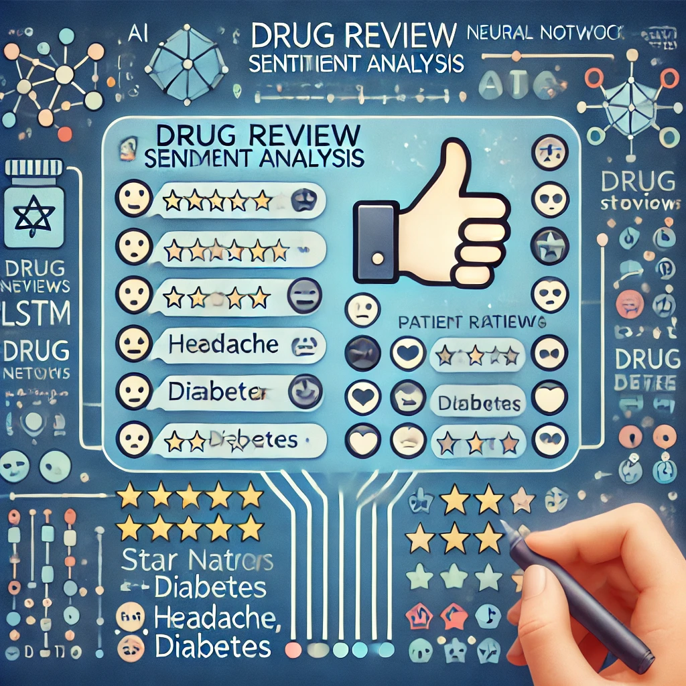

### Drug Review Sentiment Analysis

Objective:

The focus of this project is to perform sentiment analysis on patient reviews for various drugs. The goal is to predict the sentiment (positive or negative) of reviews based on textual data and related features such as drug name, condition treated, and patient ratings. The sentiment prediction will help pharmaceutical companies and healthcare professionals gain insights into patient satisfaction, identify potential issues with drugs, and ultimately improve patient outcomes.

This project will also compare the effectiveness of building and training a model using this dataset versus leveraging a pretrained model trained on more general data.  Organizations are often faced with a build versus buy decision and have access to their own unique datasets.  These decisions often factor in development cost, time to develop, and cost to maintain.  With machine learning, the additional factor of compute resources required to train must also be factored in.  While there is no software cost to leverage the pretrained model, this is a reasonable approximation for leveraging a closed source pretrained model from a software vendor.

Dataset Overview:

The Drug Review Dataset from the UCI Machine Learning Repository is utilized for this analysis. It contains 161,297 entries with the following 7 features:

Features:

•	drugName(categorical): Name of the drug.

•	condition(categorical): Condition treated by the drug.

•	review(text): Patient’s review text.

•	rating(numerical): 10-star rating indicating satisfaction.

•	date(date): Review entry date.

•	usefulCount(numerical): Count of users who found the review 
    helpful.

Target Variable: The sentiment of the review, which needs to be derived from the rating. A review rating above a certain threshold (e.g., 7/10) will be classified as positive, while a rating below this threshold will be classified as negative.However the rating provides a numerical representation of a user’s satisfaction (on a scale of 1 to 10) while the review text contains much richer, nuanced information that the rating alone cannot capture.

There are no any missing values found in the dataset.

Algorithms to Investigate:

•	LSTM (Long Short-Term Memory): To handle sequential data and capture long-term dependencies in the text reviews.

•	BERT (Bidirectional Encoder Representations from Transformers): For its ability to understand context and word semantics bidirectionally, leading to improved accuracy in sentiment analysis.

These deep learning models will be compared against traditional machine learning classifiers (e.g., LightGBM, Logistic Regression) to highlight their strengths in handling complex NLP tasks.

The system is expected to:

	•	Analyze the textual content of patient reviews to predict sentiment (positive or negative).
	•	Leverage drug ratings to assign sentiment labels to the reviews, which will serve as ground truth for training.
	•	Predict the sentiment of new, unseen reviews based on patterns learned from historical data.
	•	Provide insights into patient satisfaction for healthcare stakeholders.

The main challenges expected in this project include:

	•	Text Preprocessing: Cleaning the review text, handling special characters, stop words, and stemming/lemmatization.
	•	Imbalanced Data: Since patient satisfaction is often skewed toward positive ratings, the dataset might be imbalanced, requiring techniques like SMOTE or class weighting.
	•	Feature Engineering: Extracting meaningful features from the text, including n-grams and embeddings.
	•	Model Selection: Balancing model complexity with interpretability and performance. LSTM and BERT models require significant computational resources but may offer better accuracy than simpler classifiers.

1.	Sequential and Contextual Understanding:

	•	LSTM networks are designed to capture long-term dependencies in sequences, making them ideal for text data where the order of words matters.

	•	BERT uses a bidirectional approach to understand the context of words in both directions, leading to more accurate sentiment predictions by considering the full context.

2.	Handling Complex Language Nuances:

	•	Reviews often contain nuances, sarcasm, and complex expressions that are difficult for traditional classifiers to understand.

	•	BERT excels in understanding context, synonyms, and word sense disambiguation, which are critical for accurate sentiment analysis.

4.	State-of-the-Art Performance:

	•	LSTM and BERT have consistently outperformed traditional machine learning models on NLP tasks like sentiment analysis, text classification, and question-answering.

	•	BERT’s pre-trained embeddings can be fine-tuned on your specific dataset, allowing it to adapt to the nuances of the drug reviews.

5.	Feature Extraction from Raw Text:

	•	Traditional classifiers require extensive feature engineering, whereas deep learning models like LSTM and BERT can automatically extract high-level features from raw text data, reducing the need for manual feature engineering.

6.	Scalability for Large Datasets:

	•	With a dataset of over 160,000 entries, LSTM and BERT models can efficiently scale and handle large volumes of text, whereas simpler models may struggle with feature extraction and scalability.

References:

Research papers on sentiment analysis using LSTM and BERT.

Documentation and examples from the Hugging Face Transformers library.

Courses and tutorials on deep learning for NLP, such as Deep Learning Specialization by Andrew Ng.

Deep Learning for NLP with Pytorch — PyTorch Tutorials 2.5.0+cu124 documentation. (n.d.). https://pytorch.org/tutorials/beginner/nlp/index.html

GeeksforGeeks. (2024, March 28). How to use PyTorch for sentiment analysis on textual data? GeeksforGeeks. https://www.geeksforgeeks.org/how-to-use-pytorch-for-sentiment-analysis-on-textual-data/

Savani, B. (2022, March 30). Tutorial on Sentimental Analysis using Pytorch for Beginners | Medium. Medium. https://bhadreshpsavani.medium.com/tutorial-on-sentimental-analysis-using-pytorch-b1431306a2d7

Surdeanu, M., & Valenzuela-Escárcega, M. A. (2024). Deep learning for natural language processing : a gentle introduction (1st ed.). Cambridge University Press.

University of California, Irvine. (n.d.). Drug review dataset (Drugs.com). UCI Machine Learning Repository. https://archive.ics.uci.edu/dataset/462/drug+review+dataset+drugs+com

Padmanabhan, A., NG, K., & Cole, M. (2019). PyTorch Experiments on NLP and RNN. In Mobile Artificial Intelligence Projects. Packt Publishing, Limited.

Understanding LSTM Networks -- colah’s blog. (n.d.). https://colah.github.io/posts/2015-08-Understanding-LSTMs

Hugging Face. (n.d.). BERT. https://huggingface.co/docs/transformers/en/model_doc/bert

## Project Setup

### 1. Create or Update environemnt
a. Add dependencies in environment.yaml

b. Run setup-env.ipynb that will check and create/update environment with required libraries

c. Now you can use the created environment to set as interpretor to your project