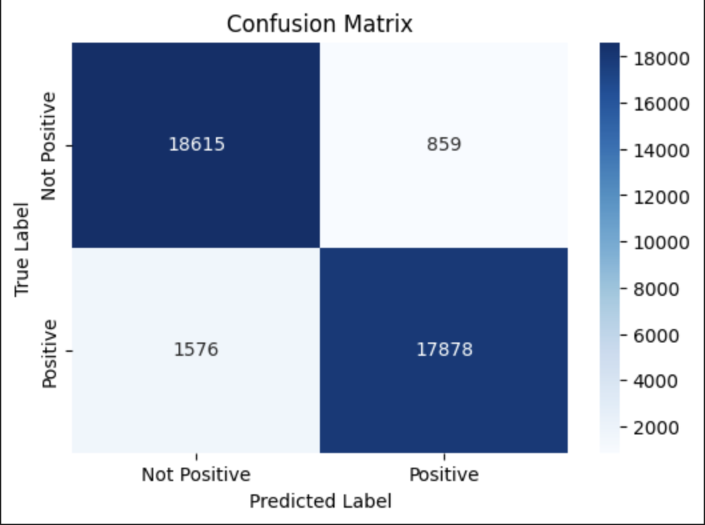
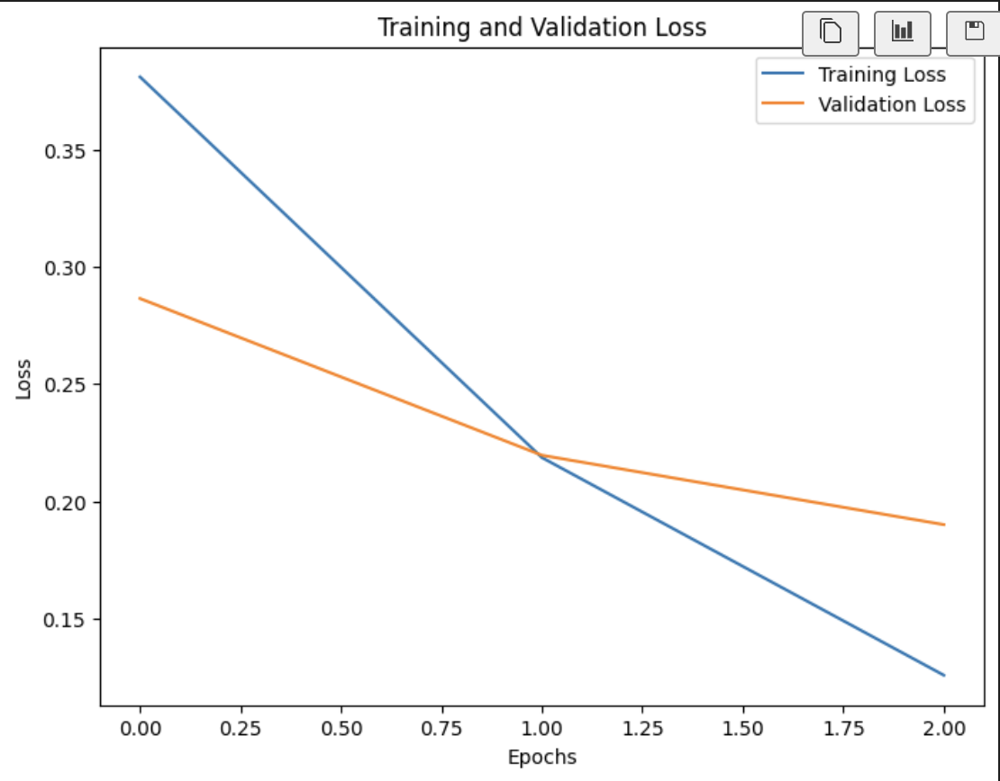

### Drug Review Sentiment Analysis

## Objective:

The focus of this project is to perform sentiment analysis on patient reviews for various drugs. The goal is to predict the sentiment (positive or negative) of reviews based on textual data and related features such as drug name, condition treated, and patient ratings. The sentiment prediction will help pharmaceutical companies and healthcare professionals gain insights into patient satisfaction, identify potential issues with drugs, and ultimately improve patient outcomes.

This project will also compare the effectiveness of building and training a model using this dataset versus leveraging a pretrained model trained on more general data.  Organizations are often faced with a build versus buy decision and have access to their own unique datasets.  These decisions often factor in development cost, time to develop, and cost to maintain.  With machine learning, the additional factor of compute resources required to train must also be factored in.  While there is no software cost to leverage the pretrained model, this is a reasonable approximation for leveraging a closed source pretrained model from a software vendor.

## Dataset Overview:

The Drug Review Dataset from the UCI Machine Learning Repository is utilized for this analysis. It contains 161,297 entries with the following 7 features:

## Features:

•	drugName(categorical): Name of the drug.

•	condition(categorical): Condition treated by the drug.

•	review(text): Patient’s review text.

•	rating(numerical): 10-star rating indicating satisfaction.

•	date(date): Review entry date.

•	usefulCount(numerical): Count of users who found the review 
    helpful.

Target Variable: The sentiment of the review, which needs to be derived from the rating. A review rating above a certain threshold (e.g., 7/10) will be classified as positive, while a rating below this threshold will be classified as negative.However the rating provides a numerical representation of a user’s satisfaction (on a scale of 1 to 10) while the review text contains much richer, nuanced information that the rating alone cannot capture.

## Exploratory Data Analysis:

The above pie chart describes the percentage of reviews on each rating available in the dataset.

Wordclouds are created to analyse the popular words seen in positive and negative reviews.

### preprocessing steps:

#### Class Imbalance in Dataset:

•	The histogram above highlights the class imbalance in the dataset, where reviews with a rating > 7 are labeled as positive, and ratings ≤ 7 are labeled as negative.

•	To address this, upsampling was applied to balance the dataset by randomly duplicating minority class samples, ensuring both classes have equal representation for the classification model.

#### Stopword Removal:

•	Stopwords were removed from the review text using the NLTK library to eliminate common, uninformative words and reduce noise in the data.

#### Lemmatization:

•	Lemmatization was performed to convert words to their base or dictionary form, effectively handling improperly formatted symbols and text within the review data.

There are no any missing values found in the dataset.

## Algorithms to Investigate:

•	LSTM (Long Short-Term Memory): To handle sequential data and capture long-term dependencies in the text reviews.

•	BERT (Bidirectional Encoder Representations from Transformers): For its ability to understand context and word semantics bidirectionally, leading to improved accuracy in sentiment analysis.

These deep learning models will be compared against traditional machine learning classifiers (e.g., LightGBM, Logistic Regression) to highlight their strengths in handling complex NLP tasks.

The system is expected to:

•	Analyze the textual content of patient reviews to predict sentiment (positive or negative).

•	Leverage drug ratings to assign sentiment labels to the reviews, which will serve as ground truth for training.

•	Predict the sentiment of new, unseen reviews based on patterns learned from historical data.

•	Provide insights into patient satisfaction for healthcare stakeholders.

The main challenges expected in this project include:

•	Text Preprocessing: Cleaning the review text, handling special characters, stop words, and stemming/lemmatization.

•	Imbalanced Data: Since patient satisfaction is often skewed toward positive ratings, the dataset might be imbalanced, requiring techniques like SMOTE or class weighting.

•	Feature Engineering: Extracting meaningful features from the text, including n-grams and embeddings.

•	Model Selection: Balancing model complexity with interpretability and performance. LSTM and BERT models require significant computational resources but may offer better accuracy than simpler classifiers.

1.	Sequential and Contextual Understanding:

	•	LSTM networks are designed to capture long-term dependencies in sequences, making them ideal for text data where the order of words matters.

	•	BERT uses a bidirectional approach to understand the context of words in both directions, leading to more accurate sentiment predictions by considering the full context.

2.	Handling Complex Language Nuances:

	•	Reviews often contain nuances, sarcasm, and complex expressions that are difficult for traditional classifiers to understand.

	•	BERT excels in understanding context, synonyms, and word sense disambiguation, which are critical for accurate sentiment analysis.

4.	State-of-the-Art Performance:

	•	LSTM and BERT have consistently outperformed traditional machine learning models on NLP tasks like sentiment analysis, text classification, and question-answering.

	•	BERT’s pre-trained embeddings can be fine-tuned on your specific dataset, allowing it to adapt to the nuances of the drug reviews.

5.	Feature Extraction from Raw Text:

	•	Traditional classifiers require extensive feature engineering, whereas deep learning models like LSTM and BERT can automatically extract high-level features from raw text data, reducing the need for manual feature engineering.

6.	Scalability for Large Datasets:

	•	With a dataset of over 160,000 entries, LSTM and BERT models can efficiently scale and handle large volumes of text, whereas simpler models may struggle with feature extraction and scalability.

## Logistic Regression

Logistic regression is a linear model and may not fully capture the complexity of non-linear relationships in the data.

Sentiment analysis often involves contextual and nuanced language, which might not be effectively modeled by a simple linear classifier.

The features (review_len, neg, pos, compound) are limited in scope and may not fully represent the richness of the review text.

#### Model Evaluation :

    Classification Report:
                precision    recall  f1-score   support

            0       0.62      0.68      0.65     21417
            1       0.64      0.58      0.61     21417

    accuracy                           0.63     42834
    macro avg       0.63      0.63      0.63     42834
    weighted avg    0.63      0.63      0.63     42834

## LSTM(Least Short Term Memory)

Confusion Matrix and Training and Validation loss:

Observations:

•	True Negatives (TN): 27,970 predictions correctly identified as “Not Positive.”

•	False Positives (FP): 4,379 predictions incorrectly classified as “Positive.”

•	False Negatives (FN): 3,968 predictions incorrectly classified as “Not Positive.”

•	True Positives (TP): 28,381 predictions correctly identified as “Positive.”

•	The training loss decreases steadily, showing that the model is learning from the training data effectively.

•	The validation loss follows a similar trend initially but starts to flatten around epoch 25 and slightly increases thereafter.

•	This increase in validation loss indicates that the model might be overfitting the training data after epoch 25.

## BERT(Bidirectional Encoder Representations from Transformers)

#### Pretrained Language Model:

The pretrained bert-base-uncased version is loaded, which has already been trained on large corpora such as Wikipedia and BookCorpus. This provides a solid understanding of general language patterns.

#### Text Tokenization:

Input text (e.g., reviews) is first preprocessed and tokenized using BERT’s WordPiece Tokenizer.

Each review is split into smaller subwords or tokens, allowing the model to handle rare or unknown words effectively.

The tokenized input is padded or truncated to a fixed maximum length (e.g., 128 or 256 tokens) for uniformity.

#### Embedding Generation:

The tokenized inputs, including token IDs, attention masks, and segment IDs, are passed through BERT’s encoder layers.

BERT generates contextual embeddings, where each word’s representation captures the context of the entire sentence (bidirectional understanding).

#### Fine-Tuning for Sentiment Classification:

A classification head is added on top of the BERT model to map the embeddings to the desired sentiment labels (e.g., positive or negative).

During training, the pretrained BERT layers are fine-tuned on the sentiment dataset, adjusting the weights to make the model specific to the task.

#### Dropout for Regularization:

A dropout layer is applied to reduce overfitting and improve the model’s ability to generalize to unseen data.

#### Binary Classification:

The classification layer outputs logits (raw scores) for the two classes.The logits are converted to probabilities using a softmax or sigmoid function, depending on the implementation, and the class with the highest probability is selected.

#### Optimization and Training:

The model is trained using the AdamW optimizer, which ensures efficient updates to the weights.A low learning rate (e.g., 1e-5 or 2e-5) is used to avoid overwriting the pretrained weights drastically.The loss function used is binary cross-entropy loss for two-class classification (positive vs. negative).

#### Evaluation:

After training, the model is evaluated on a validation set to monitor metrics such as accuracy, precision, recall, and F1-score.Predictions are made on the test set using the fine-tuned BERT model to measure its performance.

    Classification Report:
                precision    recall  f1-score   support

    Not Positive       0.92      0.96      0.94     19474
        Positive       0.95      0.92      0.94     19454

        accuracy                           0.94     38928
       macro avg       0.94      0.94      0.94     38928
    weighted avg       0.94      0.94      0.94     38928

Below is the confusion matrix in model evaluations ,

## Conclusions and Recommendations :

**Observations**

-	True Negatives (TN) = 18615: The model correctly identified 13890 
    true negative reviews

	False Positives (FP) = 1576: The model incorrectly labeled 948 positive reviews as negatives.

	False Negatives (FN) = 859: The model incorrectly labeled 791 snegative reviews as positives.

	True Positives (TP) = 17878: The model correctly identified 23299 positive reviews.

#### Precision:

Class 0 (Positive): 0.92 – Out of all predictions made for positive, 64% were correct. This means that 5% of positive predictions were false positives.

Class 1 (Negative): 0.95 – Out of all predictions made for Negative, 
71% were correct. This indicates that 4% of negative predictions were false positives.

#### Conclusion: 
	
The model is slightly better at predicting positive compared to negative, as evidenced by higher precision for Class 1.

#### Recall:

Class 0 (Negative): 0.96 – The model correctly identified 95% of actual positive reviews, but missed 5% (false negatives).

•	Class 1 (Positive): 0.92 – The model correctly identified only 96% of the negative reviews, meaning that 4% of negative were missed.

#### Conclusion:

The model performs better in recognizing positive than negatives, 
as shown by higher recall for Class 1. The recall for Class 0 is relatively low, indicating many negative reviews are misclassified as positive.

#### F1-Score:

Class 0 (Positive): 0.94 – This is a balanced metric combining precision and recall for positive, showing a good balance between false positives and false negatives.

Class 1 (Negatives): 0.94 – The F1-score for negative indicates that the model struggles with negative detection compared to positive detection.

#### Conclusion: 

The model’s performance is good , though slightly better at predicting positive.

#### Overall Accuracy:

The model’s accuracy is 94%, meaning that 94% of the total predictions (negative and positive) were correct.

#### Macro and Weighted Averages:

The macro average precision, recall, and F1-score are all approximately 0.94, 

indicating that, on average, the model performs similarly across both classes.

#### Strengths:

•	The model performs reasonably well in identifying positive, with high recall for Class 0 (94%). This means it’s less likely to miss a positive review.

•	 Precision for negative is good (94%), so when the model does predict a negative, it’s more likely to be correct.

#### Weaknesses:

•	The model perform good with recall for negative and positive, correctly identifying only 96% of them. 

This means it misses a significant portion of negative, incorrectly classifying them as positive.

## References:

Research papers on sentiment analysis using LSTM and BERT.

Documentation and examples from the Hugging Face Transformers library.

Courses and tutorials on deep learning for NLP, such as Deep Learning Specialization by Andrew Ng.

Deep Learning for NLP with Pytorch — PyTorch Tutorials 2.5.0+cu124 documentation. (n.d.). https://pytorch.org/tutorials/beginner/nlp/index.html

GeeksforGeeks. (2024, March 28). How to use PyTorch for sentiment analysis on textual data? GeeksforGeeks. https://www.geeksforgeeks.org/how-to-use-pytorch-for-sentiment-analysis-on-textual-data/

Savani, B. (2022, March 30). Tutorial on Sentimental Analysis using Pytorch for Beginners | Medium. Medium. https://bhadreshpsavani.medium.com/tutorial-on-sentimental-analysis-using-pytorch-b1431306a2d7

Surdeanu, M., & Valenzuela-Escárcega, M. A. (2024). Deep learning for natural language processing : a gentle introduction (1st ed.). Cambridge University Press.

University of California, Irvine. (n.d.). Drug review dataset (Drugs.com). UCI Machine Learning Repository. https://archive.ics.uci.edu/dataset/462/drug+review+dataset+drugs+com

Padmanabhan, A., NG, K., & Cole, M. (2019). PyTorch Experiments on NLP and RNN. In Mobile Artificial Intelligence Projects. Packt Publishing, Limited.

Understanding LSTM Networks -- colah’s blog. (n.d.). https://colah.github.io/posts/2015-08-Understanding-LSTMs

Hugging Face. (n.d.). BERT. https://huggingface.co/docs/transformers/en/model_doc/bert

## Project Setup

### 1. Create or Update environemnt
a. Add dependencies in environment.yaml

b. Run setup-env.ipynb that will check and create/update environment with required libraries

c. Now you can use the created environment to set as interpretor to your project